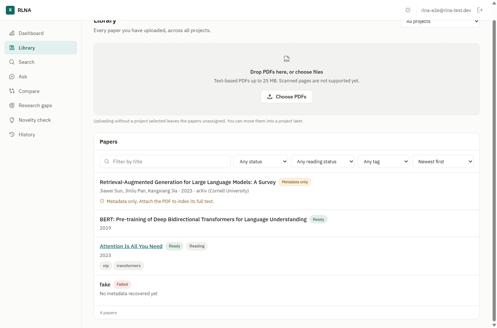
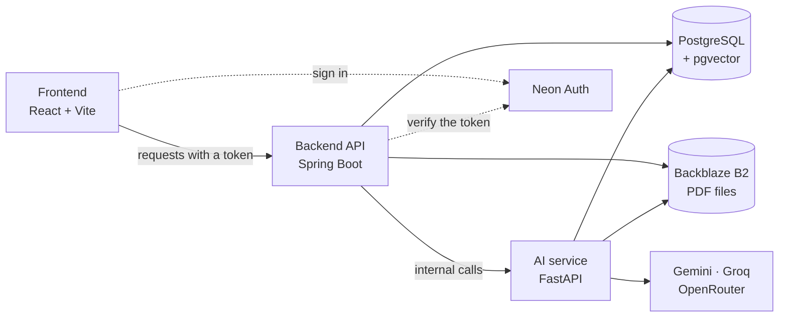
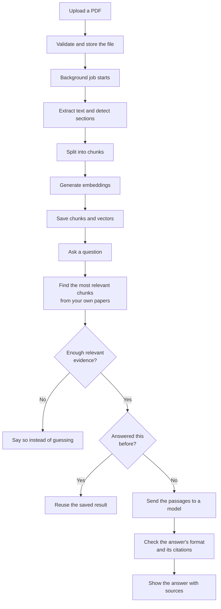

<div align="center">


# RLNA — Research Literature & Novelty Assistant

**A research workspace that answers questions from your own papers.**

Upload research PDFs, search them in plain English, ask questions, compare papers,
find research gaps, and check whether an idea is already covered by the literature
you have collected.

[](https://github.com/13SunnySingh12/RLNA-Research-Literature-Novelty-Assistant/actions/workflows/ci.yml)




</div>

---

## What it does

Every uploaded paper is split into sections, chunked, and converted into vectors
stored in PostgreSQL. When you ask a question, the system finds the most relevant
passages from **your own** papers and answers only from those passages.

The core rule is **honesty about evidence**: every answer cites the passages it came
from, reports its confidence, and refuses to answer when the evidence is too thin. A
claim that cites a passage which was not actually retrieved is dropped before you
ever see it.

---

## Key features

| Feature | What it does |
|---|---|
| **Paper indexing** | Extracts text from a PDF, detects sections, chunks it, and generates embeddings. Runs in the background, so closing the tab does not stop it. |
| **Semantic search** | Search by meaning, not keywords. Results are always limited to your own library. |
| **Grounded Q&A** | Ask a question about one paper or a whole project. Each claim links to the passage behind it. |
| **Paper comparison** | Compare two or three papers across nine fixed dimensions. Anything the papers do not cover is marked `Not reported`. |
| **Research gaps** | Finds gaps from the limitations and future work the authors themselves wrote. |
| **Novelty check** | Describe an idea and see the overlap, differences, and potentially novel parts against your corpus. |
| **Literature review draft** | Themes, methods, agreements, and contradictions across a project's papers. |
| **Duplicate detection** | Blocks identical re-uploads, warns on similar titles, and flags near-duplicates after indexing. |
| **Academic lookup** | Search an open academic catalogue and import a paper's details, adding the PDF later. |
| **Export** | Save any analysis as Markdown, PDF, or BibTeX. |
| **Smart model routing** | A cheap model tier for simple extraction and a strong tier for reasoning, with automatic failover across three providers. |
| **Result caching** | An identical request reuses the stored result instead of calling a model again. |

---

## Tech stack

| Layer | Technology |
|---|---|
| **Frontend** | React 19, Vite, Tailwind CSS 4, React Router, Axios, Recharts |
| **Backend API** | Spring Boot 3.4 (Java 21), Spring Security, Spring Data JPA |
| **AI service** | FastAPI (Python 3.12), PyMuPDF, Sentence-Transformers, PyTorch |
| **Database** | PostgreSQL with the pgvector extension, Flyway migrations |
| **File storage** | Backblaze B2 (S3-compatible API); MinIO for local development |
| **Authentication** | Neon Auth — email and password, Google, GitHub |
| **Embeddings** | `all-MiniLM-L6-v2`, 384 dimensions, running locally on CPU |
| **Language models** | Google Gemini, Groq, OpenRouter |
| **Infrastructure** | Docker Compose, nginx, GitHub Actions |

Embeddings run locally on the CPU, which is what keeps semantic search free to use.

---

## Architecture

Three services, each with a clear job.



- **Backend API** handles everything security-related: verifying the login token,
  checking that a paper belongs to you, validating uploads, and storing files.
- **AI service** handles the heavy processing: reading PDFs, chunking, embeddings,
  retrieval, and talking to the language models. It never checks permissions itself,
  which is why it is not publicly reachable.
- **PostgreSQL** stores papers, sections, chunks, vectors, and saved analyses.
  **Backblaze B2** stores the PDF files themselves.

### How a question gets answered



Uploaded PDFs are treated as untrusted input. Passages are passed to the model as
clearly marked evidence, answers must match a strict format, and any claim citing a
passage that was not retrieved is removed before display.

---

## Project structure

```
.
├── Backend/                 Spring Boot API — auth, papers, projects, uploads, cache
├── AI/                      FastAPI service — PDF parsing, embeddings, retrieval, prompts
├── Frontend/                React app — all pages and UI
├── Database/migrations/     Flyway migrations (the single source of truth for the schema)
├── Infrastructure/docker/   Docker Compose and nginx configuration
├── Docs/                    Architecture, API reference, and design notes
└── .github/workflows/       CI pipeline
```

Detailed documentation lives in [`Docs/`](Docs) — including the full
[API reference](Docs/API/api.md) and
[architecture notes](Docs/Architecture/architecture.md).

---

## Setup and installation

### Prerequisites

Java 21 · Maven 3.9+ · Node.js 20+ · Python 3.11+ · Docker

### Accounts you will need

| Service | Used for |
|---|---|
| **PostgreSQL host** (e.g. Neon) | The database |
| **Neon Auth** | Login. Email and password work out of the box; Google and GitHub need your own OAuth app credentials. |
| **Backblaze B2** | Storing uploaded PDFs. Create a **private** bucket and a key scoped to it. |
| **A model provider** | Google AI Studio, Groq, or OpenRouter — at least one. Without a key, upload and search still work, and analysis reports that AI is unavailable. |

### Get the code

```bash
git clone https://github.com/13SunnySingh12/RLNA-Research-Literature-Novelty-Assistant.git
```

```bash
cp .env.example .env
```

Then fill in your own values. Both backends refuse to start if a required variable is
missing, rather than failing later during an upload.

---

## Environment variables

All configuration comes from environment variables. `.env.example` lists every name.
**Never commit a filled-in `.env`** — it is git-ignored for this reason.

### Required

| Variable | Purpose |
|---|---|
| `DATABASE_URL` | Database connection string |
| `NEON_AUTH_BASE_URL` | Address of the authentication server |
| `NEON_AUTH_JWKS_URL` | Where the backend fetches keys to verify login tokens |
| `NEON_AUTH_ISSUER` | Expected token issuer (the server origin, without the auth path) |
| `ALLOWED_CALLER_TOKEN` | Shared secret protecting the AI service (at least 24 characters) |
| `FASTAPI_INTERNAL_TOKEN` | The same secret, as sent by the backend |
| `FASTAPI_BASE_URL` | Where the backend reaches the AI service |
| `FRONTEND_ORIGIN` | Browser origin allowed by CORS |
| `VITE_API_BASE_URL` | Backend address used by the browser |
| `VITE_NEON_AUTH_BASE_URL` | Auth server address used by the browser |

### File storage

| Variable | Purpose |
|---|---|
| `B2_KEY_ID`, `B2_APPLICATION_KEY` | Storage credentials |
| `B2_BUCKET_NAME` | Bucket for uploaded PDFs; must be private |
| `B2_ENDPOINT` | Storage endpoint host |
| `B2_REGION` | Must match the endpoint host, because it is part of the request signature |
| `B2_SIGNED_URL_TTL_SECONDS` | How long a download link stays valid |
| `B2_FORCE_PATH_STYLE` | Needed by the local storage stand-in |

### Models

| Variable | Purpose |
|---|---|
| `GEMINI_API_KEY`, `GROQ_API_KEY`, `OPENROUTER_API_KEY` | Provider keys; at least one is needed for analysis |
| `GEMINI_MODEL`, `GEMINI_FAST_MODEL` | Strong and fast model names |
| `GROQ_MODEL`, `GROQ_FAST_MODEL` | Strong and fast model names |
| `OPENROUTER_MODEL` | Fallback model name |
| `LLM_STRONG_ORDER`, `LLM_FAST_ORDER` | Provider order per tier; leave empty for the default |
| `AI_REQUEST_TIMEOUT_SECONDS`, `AI_MAX_RETRIES`, `AI_PROVIDER_COOLDOWN_SECONDS` | Timeout, retries, and pause after a rate limit |
| `AI_CACHE_ENABLED` | Whether repeat requests reuse saved results |
| `DUAL_MODEL_VERIFICATION` | Optional second-model check; off by default |

### Search and indexing

| Variable | Purpose |
|---|---|
| `EMBEDDING_MODEL`, `EMBEDDING_DIMENSION` | Embedding model and its vector size |
| `CHUNK_SIZE_TOKENS`, `CHUNK_OVERLAP_TOKENS` | Chunk size and overlap |
| `RETRIEVAL_TOP_K` | How many passages to retrieve |
| `RETRIEVAL_MIN_SCORE` | Minimum relevance before a request is refused |
| `SECTION_BOOST_FACTOR` | Extra weight for sections relevant to the task |
| `MAX_CONTEXT_CHARACTERS` | How much evidence fits in one prompt |

### Service settings

| Variable | Purpose |
|---|---|
| `SERVER_PORT`, `PORT` | Ports for the backend and the AI service |
| `SPRING_PROFILES_ACTIVE`, `LOG_LEVEL` | Active profile and log detail |
| `MAX_UPLOAD_SIZE_MB` | Largest allowed file |
| `ASYNC_POOL_SIZE` | Number of background indexing workers |
| `ACADEMIC_API_BASE_URL`, `ACADEMIC_API_MAILTO`, `ACADEMIC_API_RATE_LIMIT_PER_MINUTE` | Academic catalogue settings |

### Local Docker only

| Variable | Purpose |
|---|---|
| `POSTGRES_PASSWORD` | Password for the local database container |
| `MINIO_ROOT_USER`, `MINIO_ROOT_PASSWORD` | Local storage credentials; any values work, they stay on your machine |

---

## Running the project

### Option A — everything in Docker

```bash
docker compose --env-file .env -f Infrastructure/docker/docker-compose.yml up --build
```

This starts the database, local file storage, and all three services together.

### Option B — run services yourself

**1. Start local file storage** (MinIO uses the same API as Backblaze B2, so no cloud
credentials are needed):

```bash
docker compose --env-file .env -f Infrastructure/docker/docker-compose.yml up -d minio minio-init
```

**2. Install Python dependencies:**

```bash
python -m venv venv
```

```bash
./venv/bin/pip install -r AI/requirements.txt
```

> On Windows, use `venv/Scripts/python.exe` instead of `venv/bin/python`.

**3. Start the AI service:**

```bash
cd AI && ../venv/bin/python -m uvicorn app.main:app --port 8000
```

**4. Start the backend** (the database schema is created automatically on first run):

```bash
cd Backend && mvn spring-boot:run
```

**5. Start the frontend:**

```bash
cd Frontend && npm install && npm run dev
```

| Service | Address |
|---|---|
| Frontend | `http://localhost:5173` |
| Backend API | `http://localhost:8080` |
| AI service | `http://localhost:8000` |

### Running the tests

```bash
cd Backend && mvn test
```

```bash
./venv/bin/pip install -r AI/requirements-dev.txt
```

```bash
cd AI && ../venv/bin/python -m pytest
```

```bash
cd Frontend && npm run lint && npm run build
```

No test makes a real call to a model provider.

---

## Usage

1. **Sign up** with an email and password, or sign in with Google or GitHub.
2. **Create a project** to group papers around a research topic. Papers can also sit
   outside any project.
3. **Upload PDFs** — several at a time. Each file reports its own result, so one bad
   file does not cancel the rest, and you can watch indexing progress per paper.
4. **Search** your library by meaning or by keyword.
5. **Ask questions** about a single paper or a whole project, and follow each claim
   back to the passage it came from.
6. **Compare** two or three papers side by side.
7. **Find research gaps** across a project.
8. **Check novelty** by describing your idea and testing it against your papers.
9. **Export** any saved analysis as Markdown, PDF, or BibTeX from the history page.

### Pages

| Route | Page |
|---|---|
| `/login`, `/signup` | Sign in and sign up |
| `/dashboard` | Overview and quick actions |
| `/library` | All papers, with filters and tags |
| `/search` | Semantic and keyword search |
| `/ask` | Question answering |
| `/compare` | Paper comparison |
| `/gaps` | Research gaps |
| `/novelty` | Novelty check |
| `/history` | Saved analyses and export |
